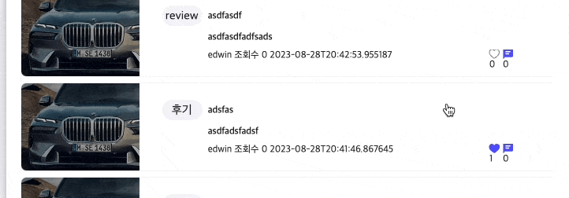

# INNO-Moters

## 리팩토링

<details>
<summary>1차 리팩토링 - 8월 1일</summary>

1. 코드유지보수 및 모듈의 재사용성 개선 : `"리엑트 모듈 인덱스"` 또는 `"바렐(rel) 모듈 인덱스"` 패턴

   <details>
   <summary>코드 살펴보기 </summary>

   ```tsx
   import Button from "./components/community";
   import Modal from "./components/css";
   import Header from "./components/atom";
   ```

   각 컴포넌트를 사용하려면 이렇게 여러줄의 임포트 구문이 필요합니다.

   ```tsx
   export * from "./community";
   export * from "./css";
   export * from "./atom";
   ```

   "components"디렉토리에 "index.ts" 파일을 추가하여 모든 컴포넌트를 내보내면

   ```tsx
   import { community, css, atom } from "../../components";
   ```

   이와 같이 간결하게 컴포넌트들을 임포트 할 수 있습니다.
   </details>

   `"리엑트 모듈 인덱스"` 또는 `"바렐(rel) 모듈 인덱스"` 패턴을 통해 코드 구조정리

   - 모듈관리용이성 : 여러 컴포넌트/파일을 단일 파일로 묶어서 관리
   - 상대경로간소화 : 컴포넌트에서 해당 디렉토리 내의 파일을 가져올 때 단순하게 표현하게 함
   - 이를 통해 상대경로 관리를 쉽게 처리하도록 하여 개발환경 개선을 시도

</details>

<details>
  <summary>2차 리팩토링 - 8월 11-12일</summary>

1. 성능최적화와 코드 스플리팅(React.lazy)

   <details>
   <summary>코드살펴보기</summary>

   ```tsx
   // lazyLoding.ts
   import { lazy } from "react";

   export const LazyInoCar = lazy(() => import("../main/InoCar").then(({ InoCar }) => ({ default: InoCar })));
   export const LazyCommunity = lazy(() => import("../main/Community").then(({ Community }) => ({default: Community})));
   export const LazyThreejs = lazy(() => import("../Threejs").then(({ Threejs }) => ({default: Threejs})));

   // App.tsx - Router
   const App: React.FC = () => {
     return (
       <Routes>
           <Route
             path='inocar'
             element={
               <Suspense fallback={<div>Loading...</div>}>
                 <Page.LazyInoCar />
               </Suspense>
             }
           />
       <Routes>
       )
   }
   ```

   </details>

- 초기 로딩 시점에 당장 필요하지 않지만 무거운 컴포넌트로 인해 로딩이 지연되는 문제를 인식
- 이를 개선하기 위해 해당 컴포넌트들의 로드를 미루어 성능을 최적화하려고 프로젝트 구조를 편성
- React.lazy를 사용하여 대상 컴포넌트들 동적제어, Suspense를 사용하여 로딩화면 제어
- lazy 대상 컴포넌트 : InoCar, Community, Threejs <br/><br/>

2. 타입선언 관련 코드컨벤션(Interface, declare)

- hooks.d.ts : 커스컴훅과 관련된 타입선언이 기록되고 이름은 훅이름으로 설정, 사용하는 컴포넌트에서는 알리아스(as)를 통하여 Type임을 명시해준다.
- 타입선언과 Interface, declare

  - `Interface` : 객체나 클래스 단위의 형태에 대한 명시적인 정의 타입 생성, extends를 통해서 앞선 Interface를 상속받아 프로토타입 체인을 형성한다.
  - `declare` : 외부 라이브러리나 모듈의 타입을 확장하거나 정의할 때 사용되며, 외부 라이브러리의 타입 정보가 없을 경우 declare를 사용함으로, 선언된 타입이 컴파일러가 타입을 검사할 때 통과되게 처리한다.

    ```bash
    📂 types
    ┣ 🥑 index.ts
    ┃
    ┣ 📂 data # 애플리케이션 내 Data와 관련된 정적타입들에 대한 선언
    ┃    ┣ 🥑 index.ts
    ┃    ┗ 🗿 data.d.ts
    ┃
    ┣ 📂 global # 프로젝트 전체에 적용되는 style과 파일 타입에 대한 선언
    ┃    ┣ 🥑 index.ts
    ┃    ┣ 🗿 declare.d.ts
    ┃    ┗ 🗿 styled.d.ts
    ┃
    ┣ 📂 hooks # 커스텀훅과 관련된 정적타입들에 대한 선언
    ┃    ┣ 🥑 index.ts
    ┃    ┗ 🗿 hooks.d.ts
    ┃
    ┣ 📂 network # AXIOS 통신과 관련된 정적타입들에 대한 선언
    ┃    ┣ 🥑 index.ts
    ┃    ┣ 🗿 async.d.ts
    ┃    ┗ 🗿 responseType.d.ts
    ┃
    ┗ 📂 props # props 전달과 관련된 정적타입들에 대한 선언
        ┣ 🥑 index.ts
        ┗ 🗿 props.d.ts
    ```

  3. 코드유지보수 및 가독성을 위한 Shared > Routes 폴더

  - 초기 APP.tsx 파일 안에 모든 Route를 넣는 방식을 채택했었으나, Route가 많아질수록 코드유지보수 및 가독성이 떨어지는 문제점을 발견함
  - 이를 해결하고자, shared 폴더를 만들어 공통된 Header에 따른 Route들을 분리함
  - App.tsx에서는 shard 폴더 안의 분리된 Routes를 import해서 사용함
          ```tsx
            const App: React.FC = () => {
            return (
              <BrowserRouter>
                <GlobalStyled />
                <Shared.MainRoutes />
                <Shared.AuthRoutes />
                <Shared.ProtectiveRouters />
                <Shared.ChatRoutes />
              </BrowserRouter>
            );
          };
          ```
    </details>

## 트러블슈팅

1.  ### 성능최적화 :  Form 태그의 input 태그들의 리렌더링 제어 및, 입력에 따른 조건부 상태메시지

- 상황 : inputValue에 따른 조건부 메시지 노출과 관련하여, onChange, onBlur 이벤트에 대응하며, input.name에 따라 각각 동작하는 상태메시지가 요구됨

  - email을 예로들 때,
    - (1) : !!input.value : 메시지 없음
    - (2) : (example@web.com) : 이메일형식 미달 : `이메일을 입력해주세요.`
    - (3) : (example@web.com) : 이메일형식 충족 : `이메일 형식에 부합합니다.`
    - (4) : onBlur(api 통신, 중복메일 확인) : `이미 사용중인 이메일입니다.`
    - (5) : onBlur(api 통신, 사용가능 확인) : `사용가능한 이메일입니다.`<br/><br/>

  <details>
  <summary>해결과정 및 결과 : inputValue 및 상태메시지의 리덕스를 통한 전역상태관리, 조건충족 시 서버통신 </summary>

      컴포넌드에서 발생되는 리렌더링을 추적하기 위해서 Chrome 브라우저에서 제공하는 React DevTool을 활용하여 해당 과정을 추적하였다.

  1.  리펙토링 전, 최초의 코드

      <details>
      <summary>내용 상세보기</summary>

      ```tsx
      // 하나의 useState와 input Atom으로 signInfo 객체의 각각의 프로퍼티를 props로 전달
      const [signInfo, setSignInfo] = useState<Type.UserInfoCheckPW>({
        email: "",
        password: "",
        pwChecked: "",
        nickname: "",
        phoneNumber: "",
        gender: "",
        birthdate: "",
        isAdmin: false,
        admincode: "E002",
      });
      ```

      - 문제점 : 하나의 value만 변경되도 signIfo의 모든 값들이 리렌더링 발생 <br/> <br/>

      ```tsx
      // input Value에 대한 유효성 검사와 하나의 useState 상태메시지
      const [validiteMsg, setValiditeMse] = useState<Type.ValiditeMsg>({
        validteEmail: ["", false],
        validtepassword: ["", false],
        passwordChMsg: ["", false],
      });

      const onChangeInput = (e: ChangeEvent<HTMLInputElement>): void => {
        const { name, value } = e.target;
        setSignInfo({ ...signInfo, [name]: value });

        if (name === "email") {
          const emailRegex = /^[^\s@]+@[^\s@]+\.[^\s@]+$/;

          emailRegex.test(value)
            ? setValiditeMse({
                ...validiteMsg,
                validteEmail: ["사용 가능한 이메일입니다.", true],
              })
            : setValiditeMse({
                ...validiteMsg,
                validteEmail: ["이메일을 입력해주세요(exam@.exam.com)", false],
              });
        }
      };
      ```

      - 상태메시지의 화면표시 : 커스텀훅에서 변경되는 validiteMsg를 컴포넌트에서 전달받아, 화면에 노출
      - 문제점 : validiteMsg 속 하나의 value만 변경되도 전체 validiteMsg의 리렌더링 발생

      </details><br/>

  2.  리펙토링 1차, useState를 커스컴훅에서 관리하여 모듈화 진행

      <details>
      <summary>내용 상세보기</summary>

      ```tsx
      export const useSignupInput = ({ name }: any): any => {
        const [input, setInput] = useState<string>("");

        const onChangeInput = (e: ChangeEvent<HTMLInputElement>) => {
          setInput(e.target.value);
        };
        return {input,onChangeInput }
      ```

      - Signup 컴포넌트 속 하나의 state로 관리되던 여러 input들의 연결고리를 끊고, 각각의 onChange에 대해서만 리렌더링 되도록 useState를 커스텀훅에서 관리하여 모듈화 함
        - 결과 : input들을 각각 리렌더링 동작시킴
        - 문제 : 분리된 input 컴포넌트의 값을 부모 컴포넌트로 끌어올려준 뒤, 통합해야하는 문제 발생
      </details><br/>

  3.  리펙토링 2차, 하위컴포넌트의 상태를 끌어올려 Form.onSubmit으로 POST 요청보내기

      <details>
      <summary>내용 상세보기</summary>

      - 리액트는 단방향을 지향하기에, 부모에서 상태를 내려주었으나, 그 결과 모든 Form태그 아래 하나의 input에서 값이 반경되더라고 모든 input이 리렌더링 되는 문제가 있었기에, 모듈화 하였지만 이를 부모컴포넌트로 끌어올려 하나의 상태로 서버와 통신하는 부분의 문제 발생
      - 접근 : 각각의 상태를 전역상태관리(Redux)로 값을 보내고, 취합된 값을 Form.onSubmit으로 통신하고자 함.

        ```tsx
        // 커스텀 훅
        export const useSignupInput = ({ name }: any): any => {
          const onBlurSignupDispatch = () => {
            dispatch(RTK.setSignupDate({ [`${name}`]: input }));
          };
        };

        // ReduxSlice
        const SignupSlice = createSlice({
          name: "SignupSlice",
          initialState: {} as any | {},
          reducers: {
            setSignupDate: (
              state,
              action: PayloadAction<Partial<SignupSliceType>>
            ) => {
              return { ...state, ...action.payload };
            },
            deleteSignupDate: () => {
              return {};
            },
          },
        });
        ```

        - 리덕스 모듈(setSignupDate) : 각각의 컴포넌트에서 나온 값을 모으는 역할을 함. 
          - name을 프로퍼티의 Keys로 설정하고 input을 Value로 설정 
          - initialState : {email: 'example@web.com'}
      </details> <br/>

  4.  리펙토링 3차, 하위컴포넌트의 상태에 따라 조건부 상태 메시지 기록하기 

          이 부분이 특히 어려웠다. 단순히 onChange 이벤트에만 대응하는 것이 아니라, onBlur 이벤트 발생시 email과 nickName의 경우 서버에 일치하는 값이 있는지 확인한 후에 해당 상태를 화면에 반영해주어야 했기 때문이다.

      <details>
      <summary>내용 상세보기</summary>  

      - 첫번째 시도, useState를 통한 각각의 메시지 관리 : 함수의 한계로, useState의 값이 입력대비 한 단계 늦는 사례 발생
      - 두번째 시도, 변수를 통한 각각의 메시지 관리 : 변수로 인해서 값의 변경을 컴포넌트가 인식하지 못하여 리렌더링이 발생되지 않음
      - 세번째 시도, 전역상태를 통한 상태관리 채택
      
        ```tsx
        // onChangeInput에서 제어할 onValiditeMsg 모듈 생성 
        const onValiditeMsg = (input: string): void => {
            if (name === "email") {
              input === ""
                ? dispatch(RTK.setValiditeMsg({ type: name, msg: ["", false] }))
                : !emailRegex.test(input)
                ? dispatch(
                    RTK.setValiditeMsg({
                      type: name,
                      msg: ["이메일을 입력해주세요(exam@.exam.com)", false],
                    })
                  )
                : dispatch(
                    RTK.setValiditeMsg({
                      type: name,
                      msg: ["이메일 형식에 부합합니다.", false],
                    })
                  );
            } 
          };

        // (1) Input의 onChange 실행에 따라, ValiditeMsg 리덕스 모듈 동작
        const onChangeInput = (e: ChangeEvent<HTMLInputElement>) => {
          setServerCheck(true);
          onValiditeMsg(e.target.value);
          setInput(e.target.value);
        };

        // (2) onBlurSignupDispatch 실행에 따라, 조건부 GET요청 실행 
        const [serverCheck, setServerCheck] = useState<boolean>(true);
        const { isSuccess: isSuccessEmailCheck,
                data: dataEmailCheck,
                isError: isErrorEmailCheck,
                error: errorEmailCheck,
          } = RTK.useGetEmailCheckQuery(input, { skip: serverCheck }); 
        const onBlurSignupDispatch = () => {
          name !== "pwChecked" && dispatch(RTK.setSignupDate({ [`${name}`]: input }));
          name === "email" && emailRegex.test(input) && setServerCheck(false);
        };
        
        useEffect(() => {
          isSuccessEmailCheck &&
            dispatch( RTK.setValiditeMsg({
                type: "email",
                msg: [dataEmailCheck, dataEmailCheck.includes("사용") ? true : false],
              })
            );
          isErrorEmailCheck && console.log(errorEmailCheck);
        }, [ isSuccessEmailCheck, dataEmailCheck, isErrorEmailCheck, errorEmailCheck, dispatch]);
        ```  

        - input 입력에 따라 2 가지 상황에서의 상태 메세지 제어가 요구되었다. 첫째는 onChangeInput, 둘째는 onBlurSignupDispatch 시 이다. 
          - onChangeInput : 입력값이 이메일 형식인지
          - onBlurSignupDispatch : 입력값이 서버에 등록된 값인지에 대한 판단
          - 두 상황에 따라 하나의 상태메시지의 관리가 요구됨 
          - 나아가 onBlurSignupDispatch에 따라 `useGetEmailCheckQuery`가 조건부 요청이 되어야 했음
            - 두 이벤트에 따라 `dispatch(RTK.setValiditeMsg({ type: name, msg: ["", false] }))`를 동작
              - msg의 내용은 조건에 따른 내용이 기록되게 하였으며,
              - type을 name으로 설정하여 해당 내용을 꺼내어 화면에 기록하도록 설정하였다. 
      </details><br/>

  5.  리펙토링 최종, 부모컴포넌트로 전달된 조건부 상태메시지(객체) 묶음으로 인한 input 태그의 연결, 동시리렌더링 제어

      - input과 관련된 state는 분리했지만, validiteMsg에 대한 상태를 리덕스를 사용하지만, 결국 하나의 state를 사용한다는 점에서 메시지 부분에서 하나의 validiteMsg이 변견되면, 전체가 리랜더링되는 문제 발생

        <details>
        <summary>수정 전 코드</summary>        

          ```tsx
          // 기존 validiteMsgSlice 
            const validiteMsgSlice = createSlice({
              name: "validiteMsgSlice",
              initialState: {
                emailMsg: ["", false],
                nickNameMsg: ["", false],
                passwordMsg: ["", false],
                pwCheckedMsg: ["", false],
              } as any,
              // .... 
            });

            export const validiteMsgReducer = validiteMsgSlice.reducer;
            export const selectValiditeMsg = (state: any) => state.validiteMsgReducer;
            export const { setValiditeMsg, deleteValiditeMsg } = validiteMsgSlice.actions;


          // 컴포넌트에서의 사용 
          import React from "react";
          import * as SC from "../css";
          import * as Type from "../../types";
          import { useSignupInput } from "../../hooks";
          import * as RTK from "../../redux";

          export const SignUpInput: React.FC<Type.SignUpInputProps> = ( ) => {
            const getValidateMsg = RTK.useAppSelector(RTK.selectValiditeMsg);

            return (
              <>
                {/* ...  */}
                {name === "email" && getValidateMsg.emailMsg && (
                  <SC.ValidateInputMsg
                    $signColor={getValidateMsg.emailMsg[1]}
                    children={getValidateMsg.emailMsg[0]}
                  />
                )}
              </>
            );
          };
          ```
        </details>


        <details>
        <summary>수정 후 코드 : input 별 [ 컴포넌트/커스텀훅 모델화 ], 이를 통해 연결고리 분리 input별 리렌저링 제어</summary>

        - 관련 input에 대한 컴포넌트 분리 + 해당 컴포넌트에 맞춘 커스텀훅 모델화 
          - SignUpInputE + useSignupEmail : onChange + onBlur(비동기통신 서버 중복확인) + 유효성검사
          - SignUpInputN + useSignupNickName : onChange + onBlur(비동기통신 서버 중복확인) + 유효성검사
          - SignUpInputP + useSignupPassword : onChange + 유효성검사
          - SignUpInputPWC + useSignupPWC : onChange + 유효성검사
          - SignUpInput + useSignup : 유효성 검사가 필요없는 컴포넌트 

        ```tsx
        // state.validiteMsgReducer에서 나가는 값에 대해서 분리 
        export const selectValiditeEMsg = (state: any) => state.validiteMsgReducer.emailMsg;
        export const selectValiditeNMsg = (state: any) => state.validiteMsgReducer.nickNameMsg;
        export const selectValiditePMsg = (state: any) => state.validiteMsgReducer.passwordMsg;
        export const selectValiditePWCMsg = (state: any) => state.validiteMsgReducer.pwCheckedMsg;

        // SignUpInputE : Eamil 관련된 input 컴포넌트 분리 
        import React from "react";
        import * as SC from "../css";
        import * as Type from "../../types";
        import { useSignupEmail } from "../../hooks";


        export const SignUpInputE: React.FC<Type.SignUpInputProps> = ({ 
          placeholder, name, type, length, inputRef, submitted }) => {
          const { input, getValidateMsg, onChangeInput, onBlurSignupDispatch } = useSignupEmail({
            name,
            submitted,
          });

          return (
            <>
              <SC.AuthInput
                ref={inputRef}
                type={type}
                value={input}
                onBlur={onBlurSignupDispatch}
                onChange={onChangeInput}
                maxLength={length}
                placeholder={placeholder}
              />
              <SC.ValidateInputMsg
                $signColor={getValidateMsg[1]}
                children={getValidateMsg[0]}
              />
            </>
          );
        };

        // SignUpInputE 에 맞춘 useSignupEmail을 별도로 구성 
        import { ChangeEvent, useEffect, useState } from "react";
        import * as RTK from "../../../redux";

        export const useSignupEmail = ({ name, submitted }: any): any => {

          const dispatch = RTK.useAppDispatch();
          const [input, setInput] = useState<string>("");
          const emailRegex = /^[^\s@]+@[^\s@]+\.[^\s@]+$/;
          const [serverCheck, setServerCheck] = useState<boolean>(true);
          const getValidateMsg = RTK.useAppSelector(RTK.selectValiditeEMsg);

          const onValiditeMsg = (input: string): void => {
            input === ""
              ? dispatch(RTK.setValiditeMsg({ type: name, msg: ["", false] }))
              : !emailRegex.test(input)
                ? dispatch(
                  RTK.setValiditeMsg({
                    type: name,
                    msg: ["이메일을 입력해주세요(exam@.exam.com)", false],
                  })
                )
                : dispatch(
                  RTK.setValiditeMsg({
                    type: name,
                    msg: ["이메일 형식에 부합합니다.", false],
                  })
                );
          }

          const onChangeInput = (e: ChangeEvent<HTMLInputElement>) => {
            setServerCheck(true);
            onValiditeMsg(e.target.value);
            setInput(e.target.value);
          };

          const onBlurSignupDispatch = () => {
            dispatch(RTK.setSignupDate({ [`${name}`]: input }));
            emailRegex.test(input) && setServerCheck(false);
          };

          const { isSuccess, data, isError, error } = RTK.useGetEmailCheckQuery(input, {
            skip: serverCheck,
          });

          useEffect(() => {
            setInput("");
          }, [submitted]);

          useEffect(() => {
            isSuccess &&
              dispatch(
                RTK.setValiditeMsg({
                  type: "email",
                  msg: [data, data.includes("사용") ? true : false],
                })
              );
            isError && console.log(error);
          }, [
            isSuccess,
            data,
            isError,
            error,
            dispatch,
          ]);

          return { input, getValidateMsg, onChangeInput, onBlurSignupDispatch }

        }
        ```        

        </details>

</details>


<details>
<summary> Three.js 빌드파일 에러 </summary>

  ```bash
  main.01a24249.js:2 Error: Minified React error #426; visit https://reactjs.org/docs/error-decoder.html?invariant=426 for the full message or use the non-minified dev environment for full errors and additional helpful warnings.
  ```

  - 컴포넌트가 마운트되기 전에 비동기 작업이 완료되어 해당 컴포넌트가 언마운트(unmounted)된 후에도 상태(state)를 업데이트하려고 할 때 발생
  
</details>

## 도전기술

  1. CD(지속적배포) : GithubAction - S3 파이프라인구축, ClouDFront-Route53(가비아) 

      <details>
      <summary>내용 상세보기</summary>

      1. AWS - S3에 빌드파일 올리기 
      2. AWS - IAM 사용자 생성(S3 CIL)
      - 위의 1~2번 과정 [19Edwin92-Githup](https://github.com/19Edwin92/FrentEnd-study/blob/main/CICD/03S3-IAM%20설정.md) 참고하기 
      <hr/>

      3. Github-WorkFlows yml파일 기록하기 

          <details>
          <summary>파일경로, main.yml 파일 생성하기</summary>

          ```bash
          # 루트폴더
          📂 .github
              ┗ 📂 workflows
                    ┗ 🗿 main.yml
          ```

          
          - main.yml 파일 기록하기 
            - name : github에 등록되는 이름
            - on : yml 파일 실행 명렁어, 실행설정 dev(branches) 변경 시
            - jobs : 해당 yml 파일의 할일 목록을 나열 
              - steps : 하단의 내용이 `name`순으로 실행된다. 
                - `Checkout repository` : 해당 저장소에 있는 코드를 깃허브 리눅스 컴퓨터로 가져오는 동작을 실행한다. 
                - `AWS IAM 사용자 설정` : 깃허브에서 제공하는 리눅스 컴퓨터에 앞에서 설정한 AWS IAM을 등록한다. 
                - `Setting .env` : 보안적인 측면을 고려하여, 프로젝트 파일에서 .env 를 두는 것이 아니라, Github-Actions 환경변수에 등록하여 보다 안전하게 환경변수가 활용되도록 하였다. 
                - `Build` : 가져온 파일의 빌드 파일을 생성한다. 
                - `Deploy to S3 bucket` : 빌드된 파일을 S3로 업로드 함으로 지속적 배포를 실행한다.<br/><br/> 

            ```yml
            name: CI/CD inocam_client to AWS S3

            on:
              push:
                branches:
                  - dev

            jobs:
              deploy:
                runs-on: ubuntu-latest
                steps:
                  - name: Checkout repository
                    uses: actions/checkout@v3

                  - name: AWS IAM 사용자 설정
                    uses: aws-actions/configure-aws-credentials@v2
                    with:
                      aws-access-key-id: ${{ secrets.AWS_ACCESS_KEY_ID }}
                      aws-secret-access-key: ${{ secrets.AWS_SECRET_ACCESS_KEY }}
                      aws-region: ${{ secrets.AWS_REGION }}  

                  - name: Setting .env
                    run: |
                      echo "REACT_APP_KAKAO_REST_API=${{ secrets.REACT_APP_KAKAO_REST_API }}" >> .env
                      echo "REACT_APP_KAKAO_REDIRECT_URL=${{ secrets.REACT_APP_KAKAO_REDIRECT_URL }}" >> .env
                      echo "REACT_APP_GOOGLE_REST_API=${{ secrets.REACT_APP_GOOGLE_REST_API }}" >> .env
                      echo "REACT_APP_GOOGLE_REDIRECT_URL=${{ secrets.REACT_APP_GOOGLE_REDIRECT_URL }}" >> .env
                      echo "REACT_APP_NAVER_REST_API=${{ secrets.REACT_APP_NAVER_REST_API }}" >> .env
                      echo "REACT_APP_NAVER_REDIRECT_URL=${{ secrets.REACT_APP_NAVER_REDIRECT_URL }}" >> .env
                      echo "REACT_APP_SERVER_API=${{ secrets.REACT_APP_SERVER_API }}" >> .env  
                      echo "REACT_APP_SOCKET_API=${{ secrets.REACT_APP_SOCKET_API }}" >> .env  
                      echo "GENERATE_SOURCEMAP=${{ secrets.GENERATE_SOURCEMAP }}" >> .env
                      cat .env
                      
                  - name: Build
                    run: |
                      npm install -g yarn
                      yarn install --immutable
                      yarn build    
                    
                  - name: Deploy to S3 bucket
                    run: |
                      aws s3 sync build/ s3://inocamfinal    
            ```
          </details></br>

      4. AWS - Route53(가비아 DNS) -> 네임서버 등록하기 

          <details>
          <summary>Route53(가비아 DNS)</summary>

          - 첫째, AWS Route53으로 이동 
            - (1) `가비아` : 도메인 구매, innomotors.co.kr
            - (2) `호스팅 영역 생성` 클릭하기 
              - 도메인 이름 : `가비아`에서 구매한 도메인 등록
              - 유형 : `퍼블릭 호스팅 영역` 선택
              - `호스팅 영역생성` 버튼 클릭 
            - (3) `가비아 네임서버` 등록하기 
              - 네임서버(DNS) : IP주소와 도메인을 연결하는 과정을 수행 
              - Route53의 레코드에서 생성된 네임서버는 총 4개인데, 이를 전부 가비아 네임서버에 등록해주면 된다. 
                - 이때, Route53 `값/트래픽 라우팅 대상`의 4개의 네임서버 마지막에 `"."` 구두점은 제외하고 기록한다. 
                  - ns-0000.awsdns-00.org
                  - ns-0000.awsdns-00.com
                  - ns-0000.awsdns-00.net
                  - ns-0000.awsdns-00.co.uk

          </details><br/>
      5. AWS - ACM을 통해서, SSL 인증서 발급받기 

          <details>
          <summary>SSL 인증서 발급받기, AWS Certificate Manager(ACM)</summary>

          - 첫째, `인증서 요청` 
            - `퍼블릭 인증서 요청` >> 다음
              - 도메인 이름(가비아에서 구매한 도메인)에 대해서 두 종류로 입력 
                - innomotors.co.kr
                - *.innomotors.co.kr
                - `요청` 버튼 클릭
            - 일정 시간이 지나면 SSL이 발급된다. 대략 1~2시간 정도 소요된다.    

          </details><br/>  

      6. CloudFront 배포 생성하기 

              Amazon CloudFront는 S3에 등록한 정적 및 동적 웹 콘텐츠를 사용자에게 배포하는 속도를 높여주는 웹 서비스의 일환이다. CloudFront는 엣지 로케이션이라고 하는 전 세계 데이터 센터 네트워크를 통해 콘텐츠를 제공하여, 사용자에게 가장 가까운 엣지 로케이션으로 라우팅되게 하여, 네트워크를 좀 더 빠르고 효율적으로 사용하도록 한다. 

              이때 위에서 인증받은 SSL 인증서가 있으면, HTTPS로 배포가 가능하다. 

          <details>
          <summary>CloudFront 배포하기</summary>

          - 첫째, `배포생성` 버큰 클릭하기 
            - `원본 도메인` : 포커스를 두면, S3에서 배포한 사이트 주소를 확인할 수 있다. 그중에 해당 사이트를 클릭한다. 
            - 클릭 한 후, 최근에는 버킷 엔드포인트 대신 S3 웹 사이트 엔드포인트를 사용하는 것이 좋다는 메시지를 볼 수 있는데, 해당 버튼을 클릭한다. `웹 사이트 엔드포인트 사용`
            - `Origin Shield 활성화`를 예로 클릭하고, `Origin Shield 리전`을 아시아 태평양(서울)로 설정하였다. 
            - 하단의 뷰어 프로토콜 정책을 `Redirect HTTP to HTTPS`로 변경함으로 https 사용을 설정했으며
            - `웹 애플리케이션 방화벽`은 보안 보호 비활성화를
            - `대체 도메인 이름(CNAME) - 선택 사항`에 위에서 발급받은 도메인 두 개를 넣어준다. 
              - innomotors.co.kr
              - www.innomotors.co.kr
            - `사용자 정의 SSL 인증서 - 선택 사항`에서는 발급받은 인증서를 넣어주였다. 
            - `기본값 루트 객체 - 선택 사항`가 중요한데, `index.html`을 입력해 준다. 
            - 이후, `배포 생성` 버튼을 클릭하면 된다. 
            
          </details><br/>
          
      7. Route 53 호스팅 영역 레코드 추가하기 

              CNAME(Canonical Name Record)
              - 기능: 하나의 도메인 이름을 다른 도메인 이름으로 매핑한다.
              - 용도: 주로 서브도메인을 메인 도메인 또는 다른 서비스로 리다이렉트 하는 데 사용된다.
              - 제한사항: 루트 레벨이서는 사용할 수 없다.
              - www.innomotors.co.kr -> innomotors.co.kr
              - blog.innomotors.co.kr -> innomotors.co.kr
              - DNS조회: 추가적인 DNS조회가 필요해 약간의 지연을 발생 시킬수 있습니다.

              ALIAS
              - 기능: 하나의 도메인 이름을 다른 도메인 이름 또는 AWS 리소스로 매팡한다.
              - 용도: AWS 리소스 (ELB, CloudFront, S3 등)을 도메인에 매핑하는데 사용한다.
              - 제한사항: ALIAS 레코드는 AWS Router53에서만 사용이 가능하고 루트 도메인에서도 사용할 수 있다.
              - DNS조회: 내부적으로 최적화가 되어있어 DNS조회 없이 빠른 응답이 가능합니다.

          <details>
          <summary>레코드 등록하기</summary>

              레코드 : 인터넷 리소스를 식별하는 역할

          - 첫째, `호스팅 영역 생성` -> `레코드 생성` 버튼을 생성한다. 
          - www.inno.... 
            - 레코드이름 : www. 붙여주고
            - 레코드유형 : CNAME - 다른 도메인 이름과 일부 AWS 리소스로 트래픽 라우팅
            - 값 : 위에서 배포한 CloudFront 도메인을 기록한다. 
            - `레코드 생성` 버튼 클릭
          - 둘째, inno....
            - 레코드 이름 : 빈칸
            - 레코드 유형 : A-IPv4 주소 및 일부 AWS 리소스로 트래픽 라우팅
            - 별칭 토글버튼 클릭 -> `CloudFront 배포에 대한 별칭` -> 해당 CloudFront 도메인을 설정
            - `레코드 생성` 버튼 클릭
            
          </details><br/>          

      </details><br/>

2. 쓰로틀링(무한스크롤)과 디바운싱(버큰클릭)

    <details>
    <summary>무한스크롤 제어와 쓰로틀링</summary>

    - 첫째, 무한스크롤을 쓰는 이유 : 한 번에 모든 데이터를 로드하지 않고 필요할 때만 작은 양의 데이터를 로드하므로 초기 로딩 속도가 빠릅니다.
    - 둘째, 쓰로틀링과 spinner(IntersectionObserver) : 무한 스크롤 사용시 발생할 수 있는 과부화를 해결하고자 쓰로틀링을 사용하였다.
    IntersectionObserver를 통해 불러온 요소들 중 마지막 요소를 관찰대상으로 등록하여, 마지막 요소가 감지 되었을 때 추가 api 요청을 보내는 방식으로 구현하였다. 이때, 무시되는 Delay 시간은 1초로 설정해놓았다. 

      ```tsx
      export const DetailReviewList: React.FC<Type.WrappingDetailProps> = () => {
        // 로직부분 생략 
        return (
          <div
            style={{
              padding: "30px 20px 26px",
              backgroundColor: "#fff",
            }}>
            {getMergeData.map((reviews: Type.TotalWrappingShopReview) =>
              (
                <ReviewInner
                  reviews={reviews}
                  key={reviews.reviewId}
                />
              )
            )}
            {data && !data.last && <div ref={fetchNextRef}/>} 
          </div>
        );
      }
      ```
    
    - 셋째, 이를 위해 무한스크롤을 구현한 코드는 아래와 같다. 
      - (1) IntersectionObserver를 통해 받아온 요소들 중 마지막 요소를 ref로 등록해 관찰대상으로 설정한다.
      - (2) 관찰대상이 감지되었을 때, 함수 onNextPageCallback가 실행된다.  
      - (3) onNextPageCallback를 통해 다음 페이지의 데이터를 불러오며, 이때 쓰로틀링을 통해 api 과부화를 막는다.  
      - (4) 페이지별로 불러오는 데이터들은 이전페이지에 대한 정보를 가지고 있지 않기에, 이를 전역상태로 관리하여, 화면에 누적되는 효과를 주었다. 
      - (5) 불러온 요소들 중 마지막 요소가 전체 데이터의 마지막 요소일시 spinner를 화면에서 none 처라 하여, 전체 데이터를 불러온 뒤로는 무한 스크롤이 일어나지 않도록 한다. 
            
      <br/>

      <details>
      <summary>전체코드 살펴보기</summary>

        ```tsx
        import { useCallback, useEffect, useRef, MutableRefObject, Dispatch, SetStateAction } from "react";

        export const useInfinityThrottle = (setPage: Dispatch<SetStateAction<number>>,isFetching:boolean): MutableRefObject<HTMLDivElement | null> => {
          const fetchNextRef = useRef<HTMLDivElement | null>(null);
          const RefetchThrottle = (callback: () => void, delay: number) => {
            let timeId: NodeJS.Timeout | null = null;
            return () => {
              if (timeId) return;
              callback();
              timeId = setTimeout(() => {
                timeId = null;
              }, delay);
            };
          };
          // eslint-disable-next-line react-hooks/exhaustive-deps
          const onNextPageCallback = useCallback(
            RefetchThrottle(() => {
              console.log("쓰로틀 시작");
              setPage((pre:number) => pre + 1);
            }, 1000),
            []
          );

          useEffect(() => {
            const observer = new IntersectionObserver(
              ([entry]) => {
                if (entry.isIntersecting && !isFetching) {
                  // 마지막 요소가 감지되었을 때, 추가요청을 보내면, 값이 오겠죠.
                  console.log("Fetching more data...");
                  onNextPageCallback();
                }
              },
              { threshold: 0.1 } // 0~1, 0.1 뷰포트 요소(100px)의 10%(10px) 감지되었을 때, 동작한다.
            );

            if (fetchNextRef && fetchNextRef.current) {
              observer.observe(fetchNextRef.current); // 관찰대상 등록
            }
          }, [isFetching, onNextPageCallback]);

          return fetchNextRef
        }
        ```
      </details><br/>

    - 넷째, `문제발생` : POST, DELET, UPDATE, 캐시무효화가 동작되지 않는 문제
      - (1) 비동기 통신의 문제였을까? 
      - (2) 무엇이 문제였을까? 
        - page를 관리하는 상태제어의 문제 
        - 해결과정
          - [1] 신규 리뷰 작성시 page상태(`url:"/api/shops/${shopId}/reviews?page=${page}&size=10"`)가 초기화가 되지않았고 리뷰가 refetch되지 않는 상태가 발생했다. 
          - [2] 새로운 댓글이 작성되면서 초기화가 되어야하는 page상태코드가 형제 컴포넌트에 존재하고 있어서 적용되지 않고 있어, 부모 컴포넌트로 끌어올려서 props로 내려줌으로써 해결하였다.
          - [3] 이를 구현하는 단계에, 만약 페이지가 1이면, 기존의 있던 전역상태의 데이터를 초기해 주어야, map() 동작시 동일 Key에 대한 에러를 방지할 수 있기에, 전역상태관리소를 비워주고, 새로 리패치된 내용들 다시 설정해주었다. 
          
            ```tsx
            useEffect(() => {
              data && console.log(`data-리패치 :${page}`, data);
              if (isSuccess) {
                // page 1
                if (page === 1) {
                  dispatch(RTK.deleteData()); // 기존에 있었던 상태 관리를 초기화 
                  dispatch(RTK.setMergeDate(data.content)); // 새롭게 변경될 데이터를 받음 
                } else {
                  // page 2 일 때 
                  dispatch(RTK.setMergeDate(data.content));
                }
                
              }
              // eslint-disable-next-line react-hooks/exhaustive-deps
            }, [data]);
            ```
    </details>

    <details>
    <summary>광클 유저의 버큰제어와 디바운싱</summary>
    <br/>
    

    - (1) 디바운싱이란?
      - 실행 빈도를 제한하는 기술로, 사용자가 입력할 때마다 어떤 행위(api요청을 보내는 것)를 반복적으로 행하는 것은 비효율적이므로, 이런 경우 디바운싱을 사용하여 일정 시간 동안 추가 이벤트가 없을 때만 실제로 작업을 실행 하게 하여 반복 행위에 대한 반응을 줄일 수 있게 된다.
    - (2) 기능구현
      - 첫째, `프로젝트에서의 사례, (1) 좋아요 광클` : 사용자가 좋아요 버튼을 여러번 눌렀을때, 좋아요 값이 사용자가 누른 만큼 반복변경되므로 디바운싱을 적용시켜 설정시간보다 빠르게(0.5s) 연속된 동작이 끝난 후 한번만 적용되는 것으로 렌더링을 최소화 하였다.
      - 둘째, 
        - [1] 먼저 `e.stopPropagation()`을 선언을 통해, 부모 요소의 onClick 이벤트가 자녀 요소에 연쇄작용을 일으키는 이벤트 버블링을 막았다.
        - [2] `clearTimeout`과 `setTimeout` : onClick이벤트가 일어났을 때 원래 실행되고 있던 timer가 있다면 이를 clearTimeout을 통해 삭제해주고, setTimeout을 통해 새로운 timer를 등록한다. 이를 통해 광클 사용자의 마지막 클릭을 인식, 마지막 클릭에 대해서만 원하는 동작(Ex.onPatchLiked({postId}))을 발생시킨다.
        - [3] `useState`를 통한 `timerId 관리` : 이때 관건은 `timer` 관리하는 것이다. 고유한 타이머를 유지하지 못하면, 여러 개의 timer가 생성되고, 여러번의 동작을 수행하게 된다. 즉 디바운싱이 처리되지 않는다는 것이다. 이 과정을 위해서, 우리는 timer를 useState로 관리하여, 하나의 timer만 존재하도록 상황을 설정하여, 코드를 제어하였다. 

    <br/>
    
    ```tsx
    const LikeBox:FC<any> = ({postId, isLike, likeCount}) => {
      const [timerId, setTimerId] = useState<any>(null);
      const [onPatchLiked] = usePatchCommunityLikedMutation()
      
      const handleDebounce = () => { 
        if (timerId) clearTimeout(timerId)
        const newTimerId = setTimeout(() => {
          console.log("디바운스 동작하지롱");
          onPatchLiked({postId})
        }, 500);
        setTimerId(newTimerId);
      };

      const onDebounceLike = (e:MouseEvent<HTMLDivElement>) => {
        e.stopPropagation()
        handleDebounce()
      }
      
      return (
      <div onClick={onDebounceLike}>
        <SC.FigureObjectFitImg width={"18px"} height={"16px"} src={isLike ? heart : heartg} alt="heart" />
        <p>{likeCount}</p>
      </div>)
    }
    ```
  </detils>

3. 페이지 네이션과 데이터 관리

    <details>
    <summary>페이지 네이션과 데이터 관리</summary>
    </details>

